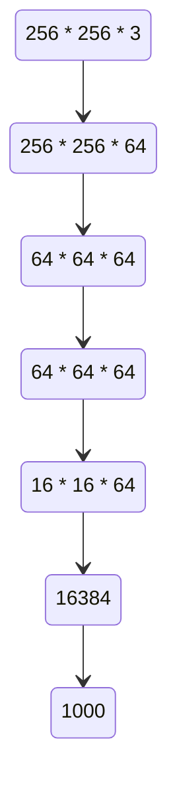

# Apprentissage Profond 5 Réseau de neurone à convolutions

## Etat de l'art

> TOP 5 : On vérifie les 5 neurones plus activées, si la réponse correcte est dedans.

A partir de 2010, le profondeur du réseau augmente très vite :
$$
shallow \to 8 \to 19 \to 22 \to 152
$$
IMAGENET: 1.2 millions d'images avec étiquettes

## CNN (Convolutional Neuro Network)

Un type particulier de réseau de neurones qui utilise les convolutions comme opérations plutôt que des opérations de multiplications matricielles.

- Pas nécessairement à chaque niveau.
- Très utile pour les données qui ont une topologie sous forme de grille. (son , image, sries temporelles)

### Architecture

可以分成多层，每层的操作相对简单。convolution, subsampling...

convolution gives "feature map".

### Convolution

*更多的定义，学过了。*

*实现是 correlation 不是 convolution，不过反正没区别。*

奇数尺寸的卷积核。

L'avantage des convolutions vs les multiplications matricielles des réseaux multicouches standard : connectivité locale. 换言之减少了“远距离”的输入之间的联系——如同一图片的左上和右下角。

### Porté des poids

dans un CNN, les poids d'un noyau sont utilisés sur toutes les entrées.

### Biais

Le biais n'est pas important dans ce type de réseaux.

## Couches spécifiques

### Pooling

避免过学习。

Cette couche remplace les sorties à l'aide de statistiques sommaires. ($max$, $mean$)

Le pooling sert à rendre la représentation peu variabe à de petits changements dans la couche d'entrées.

本质上来说和作卷积是类似的，只不过换了一种操作(`sum`, `max`)

### Padding et stride

https://github.com/vdumoulin/conv_arithmetic

## Exemple

## Dropout

On peut parfois ignorer certains neurones artificiels. (au hasard)

Moins de calculs, prévenir le surapprentissage.

C'est en fait une application du bagging à un DNN. La différence majeure avec le bagging est que les modèles ne sont pas indépendant les un des autres.

## Exemple MNIST avec CNN

见老师的 PPT 。

## Entraînement

Transfer learning: 基于已经训练进行机器学习。

## Sortie en tant que structure

输出不一定是一个标量值，甚至可以和输入尺寸相同或者更大：如：图片内容分类、“超取样”图片。

## Architectures majeures

### LENET

convolution, downsampling, sorties entièrement connectées, backpropagation.

### ALEXNET

“双核优化”、batch normalization.

### VGG

convolutions, maxpooling, couches connectées

2-3 semaines d'entraînement sur 4 GPU

### GOOGLE NET, INCEPTION

classeur auxiliaire (seulement pour l'apprentissage)

les modules inceptions : 一个网络上的局部结构，尝试提取信息，重复多次。

### RESNET

Modèle complexe, mais rapide à l'entraînement.

Fonctionne similairement aux méthodes par ensembles.

On garde une "trace" des données origines.

## Améliorations diverses

- data augmentation
- parallélisation 在 GPU 或者 TPU 上并行运行

[拓展课程](cs231n.stanford.edu)

