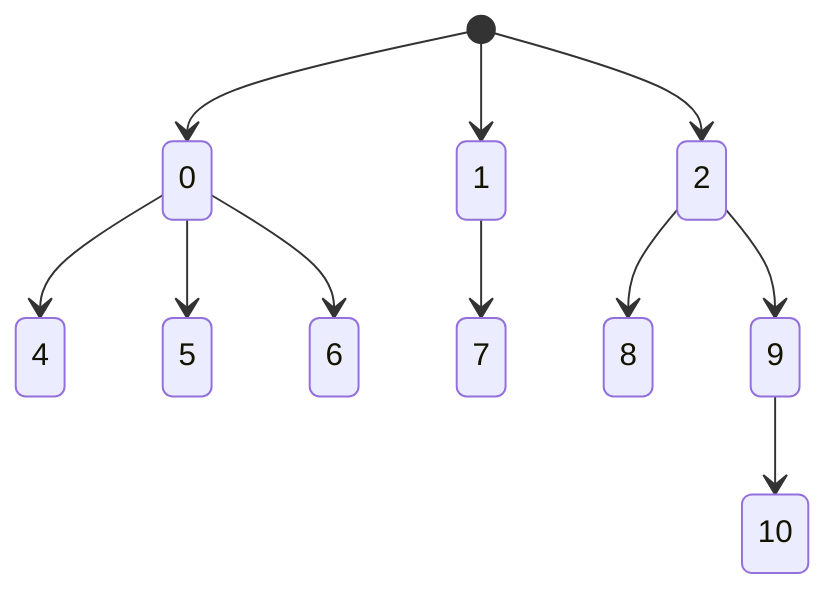
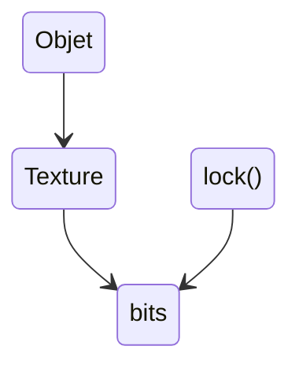

# Principes des moteurs de jeux 3 : Scripts, Développement rapide, Behavior trees

## Behavior Tree

状态机的超集？

- Actions, Conditions 叶
  - 如 4, 5, 6

- Décorateurs 有一个子结点
  - 如 7, 9

- Sélécteurs 有多个子节点
  - 如 0, 2
  - 选择，直到成功




Tick:

- succès
- échec
- en cours

可能的问题：状态太多过于复杂。

## Développement rapide

例子：在 Unity 这样的游戏引擎中动态改变游戏中的内容：参数、画面等。

需要知道内容是否外部改变——从操作系统获知；

需要选择时机动态更新内容——添加抽象层： Objet-Texture-Bits；更新放在帧之间。



> 【语言特性】反射：指程序可以了解自身的组件。

通过反射达成动态改变脚本的功能。

```pseudocode
for (;;) {
	update input;
	update logic;
	update output;
	...
	update assat; // img, etc.
	update code;  // code
}
```

### Serialisation

```c#
class Personne {
	string nom;
	int age;
	Adresse addr;
};

class Adresse {
	int num;
	string rue;
    
    void Serialize(ISer s) {
        s.write(num);
        s.write(rue);
    }
};
```

```c#
Interface ISerializer {
	void write(int value);
	void write(string val);
}

Interface IDeserializer {
	int read();
	string read();
}
```

## Scripts

| 脚本语言               | 编译语言 |
| ---------------------- | -------- |
| 解释器：虚拟机、上下文 | 编译器   |
| 弱类型                 | 强类型   |
| 慢[^1]                 | 快       |

[^1]: 由于分支预测功能可能会相较更快。

### 类型检查

```c++
LuaVM* vm = new LuaVM();
vm->Register("myFun", &myFun, LuaInt, [LuaInt]);

ctx->Exec("test.lua");
```

with

```lua
var a = ()
a = myFun(a)
```

跳过检查：

使用有功能的注释、使用有反射的语言进行预检查。

> duck typing； “鸭子类型”